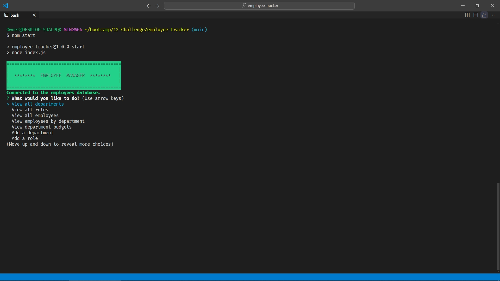
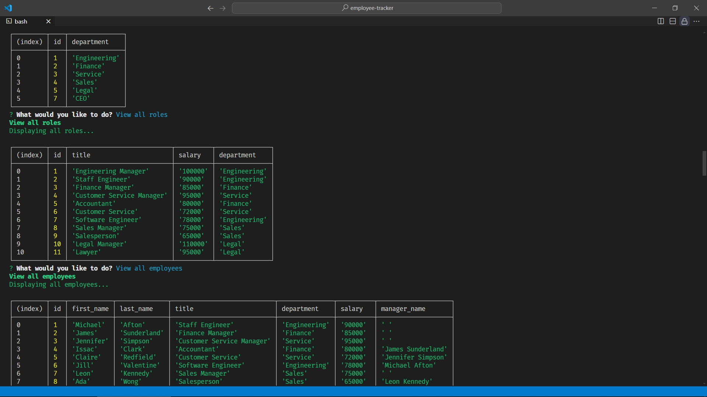
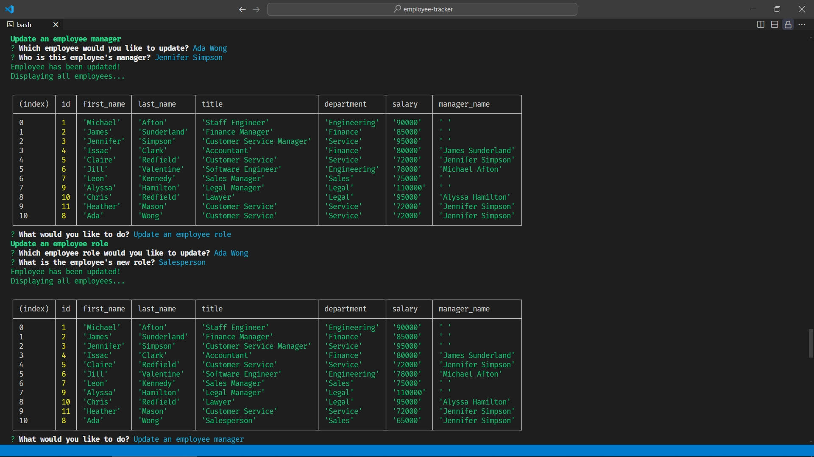

# Employee Tracker

## Table of Contents

- [Description](#description)
- [Technologies and Packages Used](#technologies-and-packages-used)
- [Installation](#installation)
- [Usage](#usage)
  - [Video Demonstrating Application In Use](#video-demonstrating-application-in-use)
  - [Screenshots of the Application](#screenshots-of-the-application)
- [Credits](#credits)
- [License](#license)

## Description

Here is an application for managing an employee database via prompts with questions for a user which runs in the backend. This utilizes the packages "Inquirer", "Dotenv", "Colors", and "PostgreSQL Node client". In addition, uses those packages with the Node language manager to view, add, update, and delete employees and various other company details from a database using PostgreSQL.

This project challenged my knowledge of the newly learned SQL management and incorporating the past techniques using Javascript. Once again, I gained much more practice working with `async...await` functions to provide users a way to enter or update information in the database dynamically. One of the milestone methods I stumbled upon during my research was IIFE functions. This made it possible to call the main menu of the application immediately after the user interacting with the application.

## Technologies and Packages Used

- [Node.js](https://nodejs.org/en)
- [Inquirer](https://www.npmjs.com/package/inquirer/v/8.2.4)
- [Colors](https://www.npmjs.com/package/colors)
- [PostgreSQL Node client](https://www.npmjs.com/package/pg)
- [Dotenv](https://www.npmjs.com/package/dotenv)
  
## Installation

First to use this application head to the [Employee Tracker](https://github.com/EXCervantes/employee-tracker) and clone the repository. To learn how to clone a repository checkout this guide [Cloning a repository](https://docs.github.com/en/repositories/creating-and-managing-repositories/cloning-a-repository).

You must have `node` installed on your system. Go [here](https://nodejs.org/en/learn/getting-started/how-to-install-nodejs) for instructions on how to do so. In addition to properly run this application natively you must have [PostgreSQL](https://www.postgresql.org/) installed on your system. Follow instructions on the website for details on how to get that application running.

Then in the Terminal run `npm install` to install the `inquirer@8.2.4`, `colors`, `pg`, and `dotenv` packages. For help on any of these refer to the respective package [above](#technologies-and-packages-used).

This application utilizes a package that requires a file named `.env` to be created on the user's native system in the root directory of the cloned repo. The following lines must exist in this file:

```md
DB_NAME='employees_db'
DB_USER='postgres'
DB_PASSWORD='user's password created during PostgreSQL install'
```

Finally to initialize this application run `node index.js` or `npm start` in the Terminal.
  
## Usage
  
To run the application open the Terminal or GitBash in VSCode and run `node index.js`. The application will ask a series of questions relating to employees and other business information from a list of options. Selecting "Quit" will terminate the application.

A user can view either all the departments, roles, and employees. Additionally, employees can be viewed sorted by department and the individual department budgets.

There are also options to add a department, role, or employee. These same options can be deleted from the database. An employee's role or their manager can be updated respectively.

### Video Demonstrating Application In Use

Here is a [link](https://drive.google.com/file/d/1Qsau0qdIgx56lyg5Y7hbXbSCSQ5c8KWY/view?usp=drive_link) to a video demonstrating how this application works.

### Screenshots of the Application





## Credits

Referenced for examples of referencing foreign keys within the same table.

"_sql - Can a foreign key refer to a primary key in the same table? - Stack Overflow_". (2018, October 6). Stack Overflow. Retrieved June 21, 2024, from https://stackoverflow.com/questions/18680680/can-a-foreign-key-refer-to-a-primary-key-in-the-same-table

Referenced for how to display retrieved database information in a table in the terminal.

"_console: table() static method - Web APIs | MDN_". (2024, March 5). MDN Web Docs. Retrieved June 21, 2024, from https://developer.mozilla.org/en-US/docs/Web/API/console/table_static

Researched on how to use and implement IIFE functions.

"_IIFE - MDN Web Docs Glossary: Definitions of Web-related terms | MDN_". (2023, June 8). MDN Web Docs. Retrieved June 21, 2024, from https://developer.mozilla.org/en-US/docs/Web/API/console/table_static
  
## License

This project is licensed under [](https://opensource.org/licenses/MIT)

Please see the [License](https://opensource.org/licenses/MIT) page for more info.
